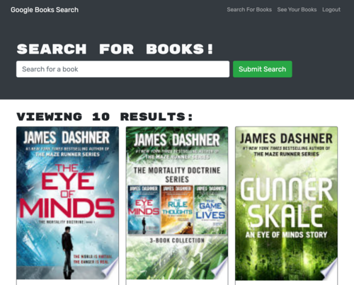
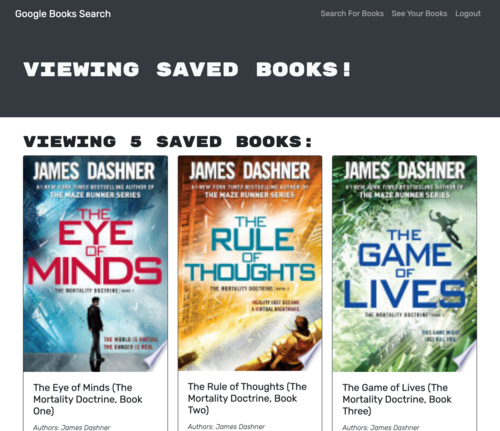

# Book-Search-Engine

## Description
The Book Search Engine application was built using the MERN stackwith a React front end, MongoDb database, and Node.js/Express.js server and API. It has been refactored to have an GraphQl API with an Apollo Server. Users can create an account, login in, search for books, and save or remove books to/from their profile.

## Table of Contents

- [Installation](#installation)
- [Usage](#usage)
- [Deployed Application](#deployed-application)
- [Credits](#credits)

## Installation
User will clone the repository. After cloning, run `npm install` to install the dependencies. Then run `npm run build` to generate the /build folder.

## Usage
Enter `npm run start` or `npm run develop` into the terminal to open this application on your local machine.

## Deployed Application

Below are links to the heroku deployed website and github repository.

* [Deployed website]()

* [Code repository](https://github.com/dhoffman03/Book-Search-Engine.git)

## Credits
This project was completed through the University of Minesota Coding Bootcamp